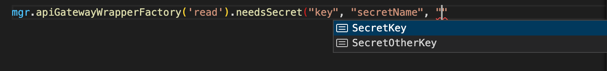

# AWS Lambda Wrappers

<a href="https://codecov.io/gh/NPellet/lambda-wrappers/branch/main/">
  
</a>

  <a href="https://github.com/NPellet/lambda-wrappers/actions/workflows/test.yaml">
  
</a>

Enhance your AWS Lambdas with wrappers to bring strong typings and runtime logic to your lambdas. Now with Sentry, Opentelemetry and Yup and Secret prefetching

## Breaking changes in v2.x

The only changes between v2.x and v1.x are in the handling of the secrets.
For the documentation of v1.x, see [documentation](https://www.npmjs.com/package/aws-lambda-handlers/v/1.0.31)

Version 2 introduces a small breaking change when working with AWS secrets. In v2, it is possible to define custom secret fetchers other than target other sources than the AWS Secret manager.
Therefore, we had to introduce a change in the following signatures:

```typescript
// Was:
new LambdaFactoryManager().setSecrets( /*...*/ )
// Now:
new LamndaFactoryManager().setAWSSecrets( /*...*/ )
////////////////////////////
// Was:
factory..needsSecret('key', 'secretName', 'secretKey', required) // required is bool
// Is:
factory.needsSecret('aws', 'key', 'secretName', 'secretKey', undefined, required )
```

The reason behind those changes in reflected in the following documentation (under [Secret injection](#secret-injection))

## Why ?

AWS Lambda's are a great piece of engineering and makes our life easier, but they're pretty "raw". For example, it would be pretty useful to:

- Wrap the handlers with Sentry (you could also use a lambda layer for that)
- Automatically parse and validate the inputs based on schemas
- Sanitize the outputs: API Gateway's responses and SQS failed batch items
- Pre-fetch a bunch of secrets from the secret manager (you should not have them defined in environment variables !)
- Have static type safety
- Overcome the shortcomings of Opentelemetry's Lambda auto-instrumentation

This package provides an opiniated stack to insert additional logic in handling lambdas triggered from the API Gateway, the Event Bridge, SQS and SNS (and we will be adding more sources later !).

<!-- vscode-markdown-toc -->

- [AWS Lambda Wrappers](#aws-lambda-wrappers)
  - [Breaking changes in v2.x](#breaking-changes-in-v2x)
  - [Why ?](#why-)
  - [How it works](#how-it-works)
  - [Installation](#installation)
  - [Features](#features)
  - [Demo Usage](#demo-usage)
    - [1. Create a service-wide (or cross-service) manager](#1-create-a-service-wide-or-cross-service-manager)
    - [2. Create a route / event handler using the manager](#2-create-a-route--event-handler-using-the-manager)
    - [3. Create a controller](#3-create-a-controller)
  - [Details](#details)
    - [Triggering from different AWS sources](#triggering-from-different-aws-sources)
    - [Notes on immutability](#notes-on-immutability)
    - [Handler method name](#handler-method-name)
  - [Detailed Usage](#detailed-usage)
    - [Main exports](#main-exports)
    - [Complete example](#complete-example)
    - [Notes on the Wrapper Factory](#notes-on-the-wrapper-factory)
    - [Other notes](#other-notes)
    - [Implementing a controller](#implementing-a-controller)
    - [Implementing multiple routes / events in a controller](#implementing-multiple-routes--events-in-a-controller)
  - [Type system](#type-system)
  - [JSON, String, Number or Buffer ?](#json-string-number-or-buffer-)
  - [Using Sentry](#using-sentry)
    - [Disabling Sentry](#disabling-sentry)
  - [Secret injection](#secret-injection)
    - [Dealing with Key-Value Secrets](#dealing-with-key-value-secrets)
    - [Dealing with String Secrets](#dealing-with-string-secrets)
    - [Providing a secret list to the manager](#providing-a-secret-list-to-the-manager)
    - [Providing alternative secret sources](#providing-alternative-secret-sources)
  - [Configuring runtime](#configuring-runtime)
    - [Manager level](#manager-level)
    - [Wrapper handler level](#wrapper-handler-level)
  - [Specificifities](#specificifities)
    - [API Gateway](#api-gateway)
      - [Input](#input)
      - [Output](#output)
      - [Error handling](#error-handling)
    - [Event Bridge](#event-bridge)
      - [Input](#input-1)
      - [Output](#output-1)
  - [A note on error handling in controllers](#a-note-on-error-handling-in-controllers)

<!-- vscode-markdown-toc-config
	numbering=false
	autoSave=true
	/vscode-markdown-toc-config -->
<!-- /vscode-markdown-toc -->

## How it works

The idea behind this framework is to declare a **Lambda Manager**, which may be common across all your microservices. It alllows you to define which secrets are available, configure secret sources for other secret managers than the one provided by AWS and configure a base Sentry configuration for all your lambdas in all your services. The lambda manager is a common source of **Handler Wrappers**, for the API Gateway, SQS, SNS or for the EventBridge.

Then, in each service, use the **Lambda Manager** to define a **Handler Wrapper**, which can be further configured (this time on a per-lambda basis) with secrets, static typings and schema validation. The **Handler Wrapper** provides a typescript interface which you should implement using a **Controller** (as simple as class defining 2 methods)

Finally, export the handler and the configuration using the **Handler Wrapper** and your defined **Controller** class.

It may sound a bit overly complex, but after using it a bit, it will all make sense.

## <a name='Installation'></a>Installation

```bash
npm i aws-lambda-wrappers
```

## Features

- Strongly typed TS Interfaces to be implemented by Controllers
- Optional payload input (and output) validation against a schema
- Wrapping with Sentry (with cross-oranisation configuration sharing)
- Tracing with Opentelemetry, separating Lambda spans with source spans (no need for the auto-instrumentation)
- Before executing a controller, secrets may be pre-fetched and provided to you
- State can easily be persisted across invocations, and cold-start initialisation can be easily used for resource acquisition

## Demo Usage

### 1. Create a service-wide (or cross-service) manager

Start by sharing a wrapper manager across all your lambda functions. This is useful to share configuration across your organisation.

Currently the manager is used for:

- Setting a global Sentry configuration
- Setting the list of available AWS secrets
- Setting another source of secrets as well as how to retrieve them

```typescript
// path/to/manager.ts
import { LambdaFactoryManager } from 'aws-lambda-wrappers';
const mgr = new LambdaFactoryManager();
// We'll import the manager later on !
export default mgr;
```

### 2. Create a route / event handler using the manager

It is good practice to separate the logic (a controller) from the handler itself (the entrypoint exposed to AWS), which allows you to swap controllers or implement multiple lambdas with a single controller. <br>
Ideally, the controller route should be `require`-able without it executing any service logic. This allows you to expose "meta-information" that can be used by other tools (for example, automatically add IAM permissions in a CDK code by loading the `configuration` object, or building an OpenAPI v3 spec, etc.)

Start by the handler file: import the manager you just exported into a new file (the one that will use by AWS to handle your function) and either start an API Gateway wrapper, and Event Bridge wrapper, an SNS wrapper or an SQS wrapper

```typescript
// path/to/route.ts
import manager from './path/to/manager'; // You can also use an npm module to share the mgr across your org
const wrapperFactory = manager
  .apiGatewayWrapperFactory('handler_name')
  .setTsInputType<string>();

import { Controller } from './path/to/controller';
export const { handler, configuration } =
  wrapperFactory.createHandler(Controller);
export type Interface = CtrlInterfaceOf<typeof wrapperFactory>;
```

### 3. Create a controller

You can now write your controller, which must implement the interface exported by the Lambda wrapper (we called it `Interface`)

```typescript
// path/to/controller.ts
import { Interface } from './path/to/route';

class Controller implements Interface {
  static async init() {
    return new Controller();
  }
  handler_name: IfHandler<Interface> = async (data, secrets) => {
    // Write your logic here
  };
}
```

And that's it for the most basic implementation ! You may now use `path/to/route.handler` as a Lambda entry-point.

## Details

In this section we explore the benefits that our approach brings.

### Triggering from different AWS sources

Wrapper factory constructors are available for

- API Gateway:
  ```typescript
    manager.apiGatewayWrapperFactory( handler: string );
  ```
- Event Bridge
  ```typescript
    manager.eventBridgeWrapperFactory( handler: string );
  ```
- SNS
  ```typescript
    manager.sqsWrapperFactory( handler: string );
  ```
- SQS
  ```typescript
    manager.snsWrapperFactory( handler: string );
  ```

The differences exist because the input types and output types are not the same whether the lambda is triggered by either of those event sources, and because the error handling is different (for example, the lambda triggered by the API Gateway should never fail, but the EventBridge lambda may be allowed fail). In addition, the SQS loop is unrolled (you implement only the method for the record, not for the whole event, which contains many records) for error management purposes.

### Notes on immutability

Both the `LambdaFactoryManager` and the derived `APIGatewayWrapperFactory` and others are **mostly** immutable (understand by it that you cannot safely rely on their immutability either). It is important to understand that most of the methods return a new instance:

```typescript
const apiWrapperFactory = new LambdaFactoryManager().apiGatewayWrapperFactory();

const apiWrapperFactory2 = api.needsSecret(/*...*/);

// apiWrapperFactory2 is of "similar" type as apiWrapperFactorty, and will require the secret
// apiWrapperFactory will NOT require the secret

// BAD !
api.needsSecret(); // Not assigned to a variable
```

### Handler method name

The string parameter passed to the constructor function defines which method must be implemented by the constructor:

```typescript
type HandlerIf = CtrlInterfaceOf<wrapperFactory>;

/* HandlerIf is of type
{
  handler_name: ( data: APIGatewayData<unknown>, secrets: Record<string, string> ): Promise<HTTPResponse<unknown> | HTTPError>
}
*/
```

The handler can be further composed to enhance the type safety and runtime safety of the controller:

```typescript
const wrapperFactory = manager
  .apiGatewayWrapperFactory('handler_name')
  .setTsInputType<Animal>()
  .setOutputSchema(
    yup.object({
      handled: yup.boolean(),
    })
  );

export type InterfaceHandler = CtrlInterfaceOf<typeof wrapperFactory>;

// Creating the handler and the configuration

import Controller from './path/to/controller';
export const { handler, configuration } =
  wrapperFactory.createWrapper(Controller);
```

## Detailed Usage

### Main exports

This package exposes 3 main objects you may want to import:

- class `LambdaFactoryManager`, which you use to create any handler
- type `CtrlInterfaceOf`, which derives the WrapperFactory into a TS interface to be implemented by the controller
- type `IfHandler`, which stands for "interface handler", and informs the controller handler about the parameter type (see examples).

### Complete example

```typescript
//====================================================================
// route.ts
import manager from 'path/to/manager';
import { MyController } from 'path/to/controller';
import { CtrlInterfaceOf } from 'aws-lambda-handlers';

// API Route definition file
const handlerWrapperFactory = manager
  .apiGatewayWrapperFactory('handle')
  .setTsInputType<INPUT_TYPE>() // Injects type safety, overrides yup schema
  .setTsOutputType<OUTPUT_TYPE>() // Injects type safety, overrides yup schema
  .setInputSchema(yupSchema) // Of type yup
  .setOutputSchema(yupSchema) // Of type yup
  .needsSecret(
    'aws',
    'process_env_key',
    'SecretName',
    'adminApiKey',
    undefined,
    true
  ) // Fetches the secrets during a cold start
  .needsSecret(
    'aws',
    'process_env_other_key',
    'SecretName',
    'apiKey',
    undefined,
    true
  );

type controllerInterface = CtrlInterfaceOf<typeof handlerWrapperFactory>;

export const { handler, configuration } =
  handlerWrapperFactory.createHandler(MyController);
export { controllerInterface }; // Export the type to be reimported by the route implementation

//====================================================================
// controller.ts
import type { controllerInterface } from 'path/to/route';

export class MyController implements controllerInterface {
  static async init() {
    return new MyController();
  }

  // Method name Has to match the .setHandler() call
  handle: IfHandler<controllerInterface> = // Without this type, req, secrets and the return value default to any
    async (req, secrets) => {
      return Response.OK_NO_CONTENT();
    };
}
```

### <a name='NotesontheWrapperFactory'></a>Notes on the Wrapper Factory

- `manager.apiGatewayWrapperFactory()` (and similarly for all other event sources) is to be done for every lambda that you wish to create. Its only argument defines the name of the handler function to be implemented in the controller
- `.setTsInputType<T>()` informs the interface on the input type you're expected to receive. We're not talking about the raw type (e.g. `APIGatewayEvent`), but rather
  - The `body` field for the API gateway (will be JSON.parse'd if the Content-Type is application/json)
  - The `detail` field for the Event Bridge
  - The `message` content for SQS and SNS
- similarly, `.setTsOutputType<T>()` informs the type of response the controller is supposed to return (or an instance of `HTTPError` if the controller failed). Only applies to API Gateway
- `setInputSchema<SCHEMA_TYPE>( schema )` and `setOutputSchema<SCHEMA_TYPE>( schema )` add a runtime verification of a `yup` schema. When `setTsInputType` is not defined but `setInputSchema` is, then the controller is expected to received the result of `InferType< SCHEMA_TYPE >` instead of `T`
- `needsSecret( source, key, secretName, secretKey, meta, required )` is used for ahead-of-execution secret injection: when a cold start occurs, the Lambda wrapper will detect if the secret has been injected into `process.env[ key ]`. If not, it will fetch it from AWS and inject it into `process.env`. It will also be made available in the handler method with strong typing.
  The `required` field can be used to outrightly fail the lambda when the secret is not found. Note that `secretName` and `secretKey` have auto-completion and will report a TS error if you have provided a secret list in the manager.

### <a name='Othernotes'></a>Other notes

Once the wrapper factory has been created, you can extract its interface type using:

```typescript
// API Gateway handler
type controllerInterface = CtrlInterfaceOf<typeof APIHandlerWrapperFactory>;

// Event bridge handler
type controllerInterface = CtrlInterfaceOf<
  typeof EventBridgeHandlerWrapperFactory
>;

// SNS handler
type controllerInterface = CtrlInterfaceOf<typeof snsHandlerWrapperFactory>;

// SQS handler
type controllerInterface = CtrlInterfaceOf<typeof sqsHandlerWrapperFactory>;
```

### Implementing a controller

Implementing a Controller has 2 requirements:

- Provide a static async initializer, called `static async init`
- Provide the method mandated by the route

```typescript
import { InterfaceHandler } from './path/to/interface';

export class Controller implements InterfaceHandler {
  constructor(private myResource: MyResource) {}

  static async init() {
    // Acquires MyResource only during a cold start
    return new Controller(new MyResource());
  }

  // Inherits the method parameter types and return type from the interface. See for details
  handler_name: IfHandler<InterfaceHandler> = async (data, secrets) => {
    return HTTPResponse.OK_NOT_CONTENT();
  };
}
```

Note on the following:

- The static initialisation is only called during an initial cold start. During the subsequent lambda invocations, the same controller instance will be reused without re-initialisation.
- The wrapper doesn't use the controller constructor directly. Instead, the async static init is used and brings the following benefits:
  - Asynchronous initialisation
  - Type safety in the controller (`myResource` is of type `MyResource`, and not of type `MyResource | undefined`)
- You may therefore use the static init method to perform any required initialisation you may desire and persist the state across invocations
- The IfHandler<> utility is provided because by default, implemented methods to do infer their parameter types from the implemented interface. See [this issue](https://github.com/Microsoft/TypeScript/issues/23911) for reference
- Several routes can be implemented using `implements IfOfRouteA, IfOfRouteB, ...``

### <a name='Implementingmultipleroutesinacontroller'></a>Implementing multiple routes / events in a controller

Depending on your design choices, you may decide to create a single controller for multiple routes, for example when handling CRUD operations. This can be achieved like that:

Routes definitions (1 file per handler, or more, but then you'd have to rename all symbols)

```typescript
// Create.ts
import Controller from 'path/to/controller';
const createHandlerWrapperFactory = manager.apiGatewayWrapperFactory('create');
export type controllerInterface = CtrlInterfaceOf<
  typeof createHandlerWrapperFactory
>;
export const { handler, configuration } =
  createHandlerWrapperFactory.createHandler(Controller);
```

```typescript
// Read.ts
import Controller from 'path/to/controller';
const readHandlerWrapperFactory = manager.apiGatewayWrapperFactory('read');
export type controllerInterface = CtrlInterfaceOf<
  typeof readHandlerWrapperFactory
>;
export const { handler, configuration } =
  readHandlerWrapperFactory.createHandler(Controller);

// Update.ts...
// Delete.ts...
```

Controller implementation

```typescript
// Controller.ts
import type { controllerInterface as createInterface } from 'path/to/create_route';
import type { controllerInterface as readInterface } from 'path/to/read_route';
import type { controllerInterface as updateInterface } from 'path/to/update_route';
import type { controllerInterface as deleteInterface } from 'path/to/delete_route';

export class Controller // The controller must now implement 4 interfaces, 1 for each route
  implements createInterface, readInterface, updateInterface, deleteInterface
{
  static async init() {
    return new Controller();
  }

  create: IfHandler<createInterface> = async (payload, secrets) => {};
  read: IfHandler<readInterface> = async (payload, secrets) => {};
  update: IfHandler<updateInterface> = async (payload, secrets) => {};
  delete: IfHandler<deleteInterface> = async (payload, secrets) => {};
}
```

## <a name='Typesystem'></a>Type system

When specifying `setTsInputType` (and `setTsOutputType` for the API Gateway), the input data will reference those types (even when a schema is set) but do nothing at the runtime (you need to set a schema for that)

When specifying a yup schema using `setInputSchema` and `setOutputSchema`, but when the corresponding `setTsInputType` and `setTsOutputType` are not set, the type of the input and output is dictated by yup's `InferType< typeof schema >`. The only way to overwrite that if - for example - yup's inferred type isn't good enough, is to override it with `setTsInputType`. This doesn't change the runtime validation, which solely depends on the presence of the schema or not.

On another note, the schema validation can be asynchronous. It is validated before your handler is called and its validation is finished before your handler is executed. If the validation fails, your wrapped handler will not be executed.

## JSON, String, Number or Buffer ?

The API Gateway, SNS and SQS pass the message body (or request as a string), and we need to make some guesswork to determine if it should be JSON parsed, base64 parsed, number parsed or not parsed at all.

Here are the rules we generally apply:

- If you have called `setInputSchema`, the handler will look at the schema type:

  - If it's an `ObjectSchema`, it will run JSON.parse before validation
  - If it's a `StringSchema`, it will run no parsing before validation
  - If it's a `NumberSchema`, it will run parseFloat before validation

- If the schema is not set, but `setTsInputType` was called, then the handler will use JSON.parse
- If `setNumberInputType`, `setStringInputType` or `setBinaryInputType` is used instead of `setTsInputType`, then the handler will parse a float, nothing and a base64 buffer, respectively

- If nothing is called, there will do no parsing and the type will unknown anyway. In other words, you will get a string for API Gateway, SQS and SNS, and potentially a JSON for the Event Bridge.

## Using Sentry

Sentry's configuration is likely to be used across your organisation's microservices, save for its DSN, which is likely to be one per service.
You may compose a manager using `.configureSentry( opts: Sentry.NodeOptions, expand: boolean )` (see [@sentry/node](https://www.npmjs.com/package/@sentry/node)), and compose it as many times as you see fit (Note that the configuration is mutable, i.e. the `configureSentry` method does not return a new manager)

The way to configure Sentry is to do it on the manager level:

```typescript
// path/to/manager.ts
import { LambdaFactoryManager } from 'aws-lambda-wrappers';
const mgr = new LambdaFactoryManager().configureSentry(
  {
    enabled: true,
  },
  true
);

// We'll import the manager later on !
export default mgr;
```

It would be a common pattern to have a shared Sentry configuration for your whole organisation, used across all services, and then overwrite the DSN in each service:

```typescript
// Import an org-wide manager
import manager from '@myorg/my-lambda-manager'; // Image you published your utility manager there
const myNewManager = manager.configureSentryDSN(MY_SENTRY_DSN);
export default myNewManager; // Optional
```

Because the configuration is mutable, lambda handlers can still reference `@myorg/my-lambda-manager` and inherit the correct DSN.

### Disabling Sentry

Additionally, Sentry can be disabled on a per-lambda basis using

```typescript
wrapperFactory.sentryDisable();
```

or by setting the environment variable DISABLE_SENTRY in the lambda's configuration (useful to avoid having to rebuild when you want to temporarily disable Sentry)

## <a name='Secretinjection'></a>Secret injection

Another cool feature of those lambda wrappers is that secrets from the AWS Secret Manager can be injected before the handler is called.
Secrets are fetched during a cold start, of after a 2h cache has expired, but never in between.

They are exposed in two ways:

- Injected into process.env
- Available in the controller method (the 2nd argument)

```typescript
controllerFactory.needsSecret(
  source, // Use 'aws' for the default AWS secret manager
  'key',
  'SecretName',
  'SecretKey',
  meta, // Use undefined for the default AWS secret manager
  true
);

class Controller implements RouteHandler {
  handler: IfHandler<RouteHandler> = async (data, secrets) => {
    // secrets is of type Record<"key", string>
    // secrets.key is available as type "string" for use
    // process.env.key is also available for use
  };
}
```

### Dealing with Key-Value Secrets

AWS Secrets can be of JSON type. It is pretty common to store a simple key-value structure in AWS, which we support for retrieval:

```typescript
controllerFactory.needsSecret(
  source,
  'process_env_key',
  'SecretName',
  'SecretKey',
  meta,
  true
);
```

Note that the lambda will fail if the provided secret is NOT JSON-valid, except if the `required` parameter is `false`.

### Dealing with String Secrets

By setting `undefined` as the second parameter, the string version of the JSON is returned.

```typescript
controllerFactory.needsSecret(
  source,
  'process_env_key',
  'SecretName',
  undefined,
  meta,
  true
);
```

When the last parameter of the `needsSecret` method is true, the secret is required and the lambda will fail if it can't be found. When false, the method will be called, but the secret may be undefined.

### Providing a secret list to the manager

Imagine an object `aws_secrets` contains the list of all available secrets in the format

```typescript
enum ENUM_OF_SECRET_NAME {
  'SecretKey',
  'SecretOtherKey',
}

export const aws_secrets = {
  secretName: ENUM_OF_SECRET_NAME,
  otherSecretName: ENUM_OF_OTHER_SECRET_NAME,
};
```

(This format can automatically be generated using the package `aws-secrets-manager-aot`)

By setting the secret list into the manager, they can provide type safety when calling `needsSecret`:

```typescript
import { LambdaFactoryManager } from 'aws-lambda-wrappers';
const mgr = new LambdaFactoryManager().setAWSSecrets(aws_secrets);
// Imagine a list of secrets, indexed by secret name on the first level, and secret key (for key-value secrets) on the second level

export default mgr;

///

mgr
  .apiGatewayWrapperFactory('read')
  .needsSecret('aws', 'key', 'secretName', 'SecretKey');
```

Autocompletion of the secret name:


Autocompletion of the secret key:



### Providing alternative secret sources

Since v2, it is possible to specify an implementation for secret managers other than the AWS secrets manager (for example, Hashicorp Vault, or some secrets from GCP)

Fetching credentials from other sources will typically require authentication, and you can store the authentication credentials in the AWS secrets manager, which will be retrieved before your custom fetcher is called.

In addition, when tuning the manager, you can require that the services consuming your manager (when using `needsSecret`) to specify an extra set of arguments along with the `secretName` and `secretKey` parameters. This "meta information" may be used to alter the behaviour of your fetcher. For example, the region where the secret manager is located, or the namespace of the secret, its version, etc...

The fetching logic is written at the manager level, so it is by default shared across projects.

```typescript
type META = {
  "metaKey": string
};

const awsSecrets = {
  "Hashicorp": {
    "Auth": "Auth",
    "OtherInfo": "OtherInfo"
  }
}

// K-V of secrets stored in your other secret manager
const otherSecrets = {
  "Secret": {
    "Key": "Key",
    "OtherKey": "OtherKey",
  },
  "Secret2": {
    "Key": "Key",
    "OtherKey": "OtherKey",
  }
}

const mgr = new LambdaFactoryManager()
  .setAWSSecrets( awsSecrets )
  .addSecretSource<META>()( // Note here the "special" syntax, due to the fact that typescript doesn't have partial type inference at the time of writing
      "HashicorpVault",
      otherSecrets,
      async ( toFetch, awsSecrets ) => {
          /*
            toFetch is of type
            Record<string, {
              source: string,
              secret: string,
              secretKey?: string,
              meta: META,
              required: boolean
            }>

            Where the key of the record is to be reused in the return object
            Promise<Record<string, string>>
          */

        const hashicorp_auth = awsSecrets.authKey;
        const other_helper_secret_from_aws = awsSecrets.otherKey;

          // Possible implementation
          let out: Record<string, string> = {};
          for( let [ k, secret ] of Object.entries( toFetch ) ) {
              out[k] = // Fetch here the secret;
          }
          return out;
      },
      ( aws ) => { // aws is a convenience function helping with auto-completion, based on the secrets passed to the manager in .setAWSSecrets()
        return {
            // With auto-completion if you're using VSCode :) !
            "authKey": aws("Hashicorp", "Auth", true),
            "otherKey": aws("Hashicorp", "OtherInfo" ) // Required defaults to true
        };
      }
    );
```

Note that the prefetching secrets are only embedded in the configuration is the consumer actually requires a secret from the added secret source. In that case, those prefetching secrets end up in the configuration and can be picked up by some of your IaC tools if you wish it.

In the example above, the "Hashicorp" secret is stored in AWS and prefetched at runtime. the `aws` method provided in the prefetch definition callback provides auto-completion with the aws secrets passed previously in `setAWSSecrets`. If the secret you need is not listed, TS will complain and you'll need to silence it. If you do not provide any AWS secrets, the `aws` method signature becomes `(string, string | undefined )` and therefore any string can be passed without TS complaining.

When the service consumes, the manager, the developer may now call:

```typescript
// Auto-completion here as well !
api.needsSecret(
  'HashicorpVault',
  'injectedKey',
  'Secret',
  'Key',
  {
    metaKey: 'metaVal',
  },
  true
);
```

Which can then be consumed by the handler as `injectedKey`

## Configuring runtime

There is a certain level of configuration you can use in order to control the behaviour, notably of unhandled errors, of the wrappers. For example, you may not wish for unhandled errors to raise an exception with Sentry, or register with Opentelemetry. You may also wish to decide what happens when schema validation fails. Those configurations can be done at the manager level (again, to be used across your organisation/services) and can be overridden on a per-lambda basis.

### Manager level

Simply call the following:

```typescript
const mgr = new LambdaFactoryManager().setRuntimeConfig({
  _general: {
    // General configuration for all types of even sources
    recordExceptionOnLambdaFail: true, // When your inner wrapper throws an unhandled error, should we record the exception ?
  },
  apiGateway: {
    recordExceptionOnValidationFail: true, // When the schema validation fails, should we record the exception ?
  },
  eventBridge: {
    failLambdaOnValidationFail: true, // When the validation fails, should we make the lambda fail (true) or just return and do nothing (false) ?
    recordExceptionOnValidationFail: true, // When the schema validation fails, should we record the exception ?
  },
  sns: {
    recordExceptionOnValidationFail: true, // When the schema validation fails, should we record the exception ?
    silenceRecordOnValidationFail: false, // When the schema validation fails, should we tag the record for a retry ?
  },
  sqs: {
    recordExceptionOnValidationFail: true, // When the schema validation fails, should we record the exception ?
    silenceRecordOnValidationFail: false, // When the schema validation fails, should we tag the record for a retry ?
  },
});
```

Notes:

- For SNS and SQS, if you want to use dead-letter queues, then `silenceRecordOnValidationFail` should be set to `false`. `true` will just not execute your handler and exit silently. For the DLQ to work, the record needs to fail, and therefore you need to retry it.

### Wrapper handler level

For each wrapper handler (one for each event source), you can call the same function with two parameters:

```typescript
wrapperFactory.configureRuntime(SpecificRuntimeConfig, GeneralRuntimeConfig);
```

Where `SpecificRuntimeConfig` matches the config for the API Gateway, EB, SNS and SQS (see section "Manager level") and `GeneralRuntimeConfig` matches the config under the key `_general` (again, see above for an example of the payload)

## Specificifities

### API Gateway

#### Input

The payload passed to your handler is of type `Request<T>` ( where `T` is the static type set in `setTsInputType` or infered from the schema).

The payload may be retrieved using:

```
declare const request: Request<any>;

// Retrieves the payload, JSON parsed and validated
const payload = request.getData();
// Returns the raw APIGatewayProxyEvent, where the body is a string
const raw = request.getRawData()
```

#### Output

To return an API Gateway Response, you are expected to return a `HTTPResponse`, using the static constructors:

```typescript
return HTTPResponse.OK(/* your data */);
// or
return HTTPResponse.OK_NO_CONTENT();
// or
// ... other static methods
```

If you set an output type with `setTsOutputType`, typescript will enforce static type safety in your response and you must conform to it.

If you set an output schema with `setOutputSchema`, javascript will validate your payload. If the payload does not validate, an HTTPError 422 will be sent to the upstream caller, in order to protect it from failing further.

To reply with a managed Error, use the static constructor methods on `HTTPError`, which take an Error or a string in their static constructor methods.

```typescript
return HTTPError.BAD_REQUEST(error);
// or
return HTTPError.BAD_REQUEST('Failure !');
```

Errors can be "acceptable" or "anormal". An anormal error will be registered with Sentry and Opentelemetry, and should indicate a condition that your service shouldn't enter. If this condition is a consequence of an invalid payload, do not set the error to anormal. This is a problem with the sender of the request. To make an error anormal, just to do following

```typescript
return HTTPError.BAD_REQUEST(error).anormal();
```

Note: `HTTPError.INTERNAL_ERROR()` is by default anormal.

In summary, the API Gateway handler should return `Promise<HTTPError | HTTPResponse<T>>`:

#### Error handling

When your lambda throws an error, the wrapper will catch it and automatically reply with `HTTPResponse.INTERNAL_ERROR( error )`, which means it's considered "anormal" and will register the exception with Sentry as well as fail the Opentelemetry span. In other words, it's perfectly acceptable to let the handler fail.

### Event Bridge

#### Input

The input type of the event bridge is of type `AwsEventBridgeEvent<T>`, and the following methods are exposed

```typescript
declare const data: AwsEventBridgeEvent<any>;

data.getData(); // => T
data.getSource(); // Returns the event source field
data.getDetailType(); // Returns the event detail-type field
data.getRawData(); // Returns the raw underlying EventBridgeEvent<string, T> object
```

#### Output

The event bridge lambda is not expect to return anything, but you may return if you so wishes. The value will be discarded.

In the following cases will Sentry and Opentelemetry pick up errors:

- When the schema doesn't validate the data
- When an unhandled exception is thrown from the lambda

## <a name='Anoteonerrorhandlingincontrollers'></a>A note on error handling in controllers

Error handling is an important part of the Lambda handler logic. Here is a list of good practices

- **Let the handler fail in case of unexpected errors**: We'll catch it for you and reply with an error 500 (for the API gateway at least). Same for SQS, we'll handle notifying the entry-point handler that the message processing has failed. We'll also notify Sentry and fail the span in Opentelemetry. Finally, we'll log appropriate messages.
- **When returning error, use the class HTTPError:** It allows us to implement some extra logic when the request fails. Also, it allows you to not respect to type `T` in `Request<T>`.
- **For errors that should be recorded, return an error like this: `return HTTPError.BAD_REQUEST( error ).anormal()`:** Any error set as "anormal" will trigger a Sentry error, register the exception in Opentelemetry and fail the tracing span.
- **`HTTPResponse.INTERNAL_ERROR` is always `anormal` and will always register**: You do not need to call `.anormal()`
