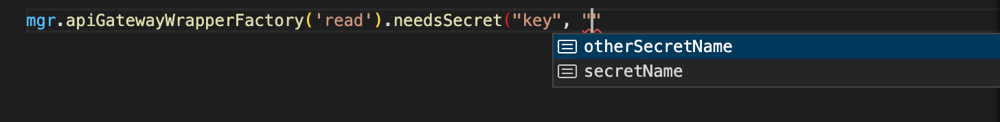

# AWS Lambda Wrappers

Enhance your AWS Lambdas with wrappers to bring strong typings and runtime logic to your lambdas. Now with Sentry, Opentelemetry and Yup

<a href="https://codecov.io/gh/NPellet/lambda-wrappers/branch/main/">
  
</a>

  <a href="https://github.com/NPellet/lambda-wrappers/actions/workflows/test.yaml">
  
</a>


## Why ?

Lambda's are a great tool, but they're pretty raw. For example, it'd be pretty useful to:

- Wrap the handlers with Sentry (you could also use a lambda layer for that)
- Sanitize API Gateway's responses and SQS failed batch items
- Pre-fetch a bunch of secrets from the secret manager (do not put secrets in the env variables !)
- Have static type safety as well as runtime payload validation
- Replace Opentelemetry's Lambda auto-instrumentation with some more logic (for example, the context may be part of the SQS payload, or part of the Event Bridge payload)

This package provides an opiniated stack to insert additional logic in handling lambdas triggered from the API Gateway, the Event Bridge, SQS and SNS (and we will be adding more sources later !).

<!-- vscode-markdown-toc -->

- [AWS Lambda Wrappers](#aws-lambda-wrappers)
  - [Why ?](#why-)
  - [Installation](#installation)
  - [Usage](#usage)
    - [1. Create a project (or organisation-wide) manager](#1-create-a-project-or-organisation-wide-manager)
    - [2. Create a route / event handler using the manager](#2-create-a-route--event-handler-using-the-manager)
    - [3. Create a controller](#3-create-a-controller)
  - [Details](#details)
    - [Wrapper available for AWS sources:](#wrapper-available-for-aws-sources)
    - [Handler method name](#handler-method-name)
  - [Detailed Usage](#detailed-usage)
    - [Complete example](#complete-example)
    - [Notes on the Wrapper Factory](#notes-on-the-wrapper-factory)
    - [Other notes](#other-notes)
    - [Implementing a controller](#implementing-a-controller)
    - [Implementing multiple routes / events in a controller](#implementing-multiple-routes--events-in-a-controller)
  - [Type system](#type-system)
  - [JSON, String, Number or Buffer ?](#json-string-number-or-buffer-)
  - [Using Sentry](#using-sentry)
    - [Disabling Sentry](#disabling-sentry)
  - [Secret injection](#secret-injection)
    - [Dealing with Key-Value Secrets](#dealing-with-key-value-secrets)
    - [Dealing with String Secrets](#dealing-with-string-secrets)
    - [Providing a secret list to the manager](#providing-a-secret-list-to-the-manager)
  - [API Gateway output](#api-gateway-output)
  - [A note on error handling in controllers](#a-note-on-error-handling-in-controllers)

<!-- vscode-markdown-toc-config
	numbering=false
	autoSave=true
	/vscode-markdown-toc-config -->
<!-- /vscode-markdown-toc -->

Features:
- Each handler provides an interface to be implemented by a controller
- Each controller receives a strongly type-checked deserialized payload
- Before executing the controller, there is optional runtime schema validation (leveraging yup)
- All handlers may be automatically wrapped by Sentry, with configuration-sharing
- All handlers provide Opentelemetry context and 1 or 2 spans, overcoming the shortcomings of the OTel lambda instrumentation
- Before executing a controller, secrets may be pre-fetched and provided to you
- State can easily be persisted across invocations, and cold-start initialisation can be easily used for resource acquisition

## <a name='Installation'></a>Installation

```bash
npm i aws-lambda-wrappers
```

## Usage

### 1. Create a project (or organisation-wide) manager

Start by sharing a wrapper manager across all your lambda functions. This is useful to share configuration across your organisation.

Currently, this is only useful for the list of usable secrets, but it may be extended in the future.

```typescript
// path/to/manager.ts
import { LambdaFactoryManager } from 'aws-lambda-wrappers'
const mgr = new LambdaFactoryManager();
// We'll import the manager later on !
export default mgr;
```

### 2. Create a route / event handler using the manager
It is good practice to separate the logic (a controller) from the lambda itself (exposing the handler to AWS), which would allow you to swap out controllers or implement multiple lambdas in a single controller. <br>
Ideally, the controller route should be `require`-able without it executing any service logic. This allows you to expose "meta-information" that can be used by other tools (for example, automatically add IAM permissions in a CDK code by looading the `configuration` object)

Start by the handler file: import the manager you just exported into a new file (the one that will use by AWS to handle your function) and either start an API Gateway wrapper, and Event Bridge wrapper, an SNS wrapper or an SQS wrapper

```typescript
// path/to/route.ts
import manager from './path/to/manager' // You can also use an npm module to share the mgr across your org
const wrapperFactory = manager.apiGatewayWrapperFactory( "handler_name" ).setTsInputType<string>();

import { Controller } from './path/to/controller'
export const { handler, configuration } = wrapperFactory.createHandler( Controller )
export type Interface = APIGatewayCtrlInterface<typeof wrapperFactory>
```

### 3. Create a controller

You can now write your controller, which must implement the interface exported by the Lambda wrapper
```typescript
// path/to/controller.ts
import { Interface } from './path/to/route'

class Controller implements Interface {
  static async init() {
    return new Controller();
  }
  handler_name: IfHandler<Interface> = async( data, secrets ) => {
    // Write your logic here
  }
}
```

And that's it for the most basic implementation !
Use `path/to/route.handler` as a Lambda entry-point.

We've added a lot of stuff, which may not really make sense and seems burdensome. Let's now move to the real added value of this setup.

## Details
 
### Wrapper available for AWS sources:
Wrapper factory constructors are available for

- API Gateway:
  ```typescript
    manager.apiGatewayWrapperFactory( handler: string );
  ```
- Event Bridge
  ```typescript
    manager.eventBridgeWrapperFactory( handler: string );
  ```
- SNS
  ```typescript
    manager.sqsWrapperFactory( handler: string );
  ```
- SQS
  ```typescript
    manager.snsWrapperFactory( handler: string );
  ```

### Handler method name
The string parameter passed to the constructor function defines which method must be implemented by the constructor:

```typescript
type HandlerIf = APIGatewayCtrlInterface<wrapperFactory>

/* HandlerIf is of type
{
  handler_name: ( data: APIGatewayData<unknown>, secrets: Record<string, string> ): Promise<HTTPResponse<unknown> | HTTPError>
}
*/
```

The handler can be further composed to enhance the type safety and runtime safety of the controller:

```typescript

const wrapperFactory = manager
  .apiGatewayWrapperFactory( "handler_name" )
  .setTsInputType<Animal>()
  .setOutputSchema( yup.object( {
    handled: yup.boolean()
  }));

export type InterfaceHandler = APIGatewayCtrlInterface< typeof wrapperFactory >

// Creating the handler and the configuration

import Controller from './path/to/controller'
export const { handler, configuration } = wrapperFactory.createWrapper( Controller )
```


## Detailed Usage

### Complete example

```typescript
//====================================================================
// route.ts
import manager from 'path/to/manager'
import { MyController } from 'path/to/controller';
import { APIGatewayCtrlInterface } from 'aws-lambda-handlers';

// API Route definition file
const handlerWrapperFactory = manager.apiGatewayWrapperFactory('handle')
  .setTsInputType<INPUT_TYPE>() // Injects type safety, overrides yup schema
  .setTsOutputType<OUTPUT_TYPE>() // Injects type safety, overrides yup schema
  .setInputSchema(yupSchema) // Of type yup
  .setOutputSchema(yupSchema) // Of type yup
  .needsSecret('process_env_key', 'SecretName', 'adminApiKey', true) // Fetches the secrets during a cold start
  .needsSecret('process_env_other_key', 'SecretName', 'apiKey', true);

type controllerInterface = APIGatewayCtrlInterface<
  typeof handlerWrapperFactory
>;

export const { handler, configuration } = handlerWrapperFactory.createHandler(MyController);
export { controllerInterface }; // Export the type to be reimported by the route implementation

//====================================================================
// controller.ts
import type { controllerInterface } from 'path/to/route';

export class MyController implements controllerInterface {
  static async init() {
    return new MyController();
  }

  // Method name Has to match the .setHandler() call
  handle: IfHandler<controllerInterface> = // Without this type, req, secrets and the return value default to any
    async (req, secrets) => {
      return Response.OK_NO_CONTENT();
    };
}
```

### <a name='NotesontheWrapperFactory'></a>Notes on the Wrapper Factory

- `manager.apiGatewayWrapperFactory()` (and similarly for all other event sources) is to be done for every lambda that you wish to create. Its only argument defines the name of the handler function to be implemented in the controller
- `.setTsInputType<T>()` informs the interface on the input type you're expected to receive. We're not talking about the raw type (e.g. `APIGatewayEvent`), but rather
  - The `body` field for the API gateway (will be JSON.parse'd if the Content-Type is application/json)
  - The `detail` field for the Event Bridge
  - The `message` content for SQS and SNS
- similarly, `.setTsOutputType<T>()` informs the type of response the controller is supposed to return (or an instance of `HTTPError` if the controller failed). Only applies to API Gateway
- `setInputSchema<SCHEMA_TYPE>( schema )` and `setOutputSchema<SCHEMA_TYPE>( schema )` add a runtime verification of a `yup` schema. When `setTsInputType` is not defined but `setInputSchema` is, then the controller is expected to received the result of `InferType< SCHEMA_TYPE >` instead of `T`
- `needsSecret( key, secretName, secretKey, required )` is used for ahead-of-execution secret injection: when a cold start occurs, the Lambda wrapper will detect if the secret has been injected into `process.env[ key ]`. If not, it will fetch it from AWS and inject it into `process.env`. It will also be made available in the handler method with strong typing.
  The `required` field can be used to outrightly fail the lambda when the secret is not found. Note that `secretName` and `secretKey` have auto-completion and will report a TS error if you have provided a secret list in the manager.

### <a name='Othernotes'></a>Other notes

Once the wrapper factory has been created, you can extract its interface type using:

```typescript
// API Gateway handler
type controllerInterface = APIGatewayCtrlInterface<
  typeof handlerWrapperFactory
>;

// Event bridge handler
type controllerInterface = EventBridgeCtrlInterface<
  typeof handlerWrapperFactory
>;

// SNS handler
type controllerInterface = SNSCtrlInterface<
  typeof handlerWrapperFactory
>;

// SQS handler
type controllerInterface = SQSCtrlInterface<
  typeof handlerWrapperFactory
>;

```


### Implementing a controller

Implementing a Controller has 2 requirements:

- Provide a static async initializer, called `static async init`
- Provide the method mandated by the route

```typescript
import { InterfaceHandler } from './path/to/interface'

export class Controller implements InterfaceHandler {

  constructor( private myResource: MyResource ) {

  }

  static async init() {
    // Acquires MyResource only during a cold start
    return new Controller( new MyResource() );
  }

  // Inherits the method parameter types and return type from the interface. See for details
  handler_name: IfHandler<InterfaceHandler> = async ( data, secrets ) => {
    return HTTPResponse.OK_NOT_CONTENT();
  }
}
```

Note on the following:

- The static initialisation is only called during an initial cold start. During the subsequent lambda invocations, the same controller instance will be reused without re-initialisation.
- The wrapper doesn't use the controller constructor directly. Instead, the async static init is used and brings the following benefits:
  - Asynchronous initialisation
  - Type safety in the controller (`myResource` is of type `MyResource`, and not of type `MyResource | undefined`)
- You may therefore use the static init method to perform any required initialisation you may desire and persist the state across invocations
- The IfHandler<> utility is provided because by default, implemented methods to do infer their parameter types from the implemented interface. See [this issue](https://github.com/Microsoft/TypeScript/issues/23911) for reference
- Several routes can be implemented using `implements IfOfRouteA, IfOfRouteB, ...``

### <a name='Implementingmultipleroutesinacontroller'></a>Implementing multiple routes / events in a controller

Depending on your design choices, you may decide to create a single controller for multiple routes, for example when handling CRUD operations. This can be achieved like that:

Routes definitions (1 file per handler, or more, but then you'd have to rename all symbols)

```typescript
// Create.ts
import Controller from 'path/to/controller';

const createHandlerWrapperFactory = manager.apiGatewayWrapperFactory('create');
  
type controllerInterface = APIGatewayCtrlInterface<
  typeof createHandlerWrapperFactory
>;

export const { handler, configuration } = createHandlerWrapperFactory.createHandler(Controller);
export { controllerInterface };
```

```typescript
// Read.ts
import Controller from 'path/to/controller';

const readHandlerWrapperFactory = manager.apiGatewayWrapperFactory('read');

type controllerInterface = APIGatewayCtrlInterface<
  typeof readHandlerWrapperFactory
>;

export const { handler, configuration } = readHandlerWrapperFactory.createHandler(Controller);
export { controllerInterface };

// Update.ts...
// Delete.ts...
```

Controller implementation

```typescript
// Controller.ts
import type { controllerInterface as createInterface } from 'path/to/create_route';
import type { controllerInterface as readInterface } from 'path/to/read_route';
import type { controllerInterface as updateInterface } from 'path/to/update_route';
import type { controllerInterface as deleteInterface } from 'path/to/delete_route';

export class Controller // The controller must now implement 4 interfaces, 1 for each route
  implements createInterface, readInterface, updateInterface, deleteInterface
{
  static async init() {
    return new Controller();
  }

  create: IfHandler<createInterface> = async (payload, secrets) => {};
  read: IfHandler<readInterface> = async (payload, secrets) => {};
  update: IfHandler<updateInterface> = async (payload, secrets) => {};
  delete: IfHandler<deleteInterface> = async (payload, secrets) => {};
}
```

## <a name='Typesystem'></a>Type system

When specifying `setTsInputType` (and `setTsOutputType` for the API Gateway), the input data will reference those types (even when a schema is set) but do nothing at the runtime (you need to set a schema for that)

When specifying a yup schema using `setInputSchema` and `setOutputSchema`, but when the corresponding `setTsInputType` and `setTsOutputType` are not set, the type of the input and output is dictated by yup's `InferType< typeof schema >`. The only way to overwrite that if - for example - yup's inferred type isn't good enough, is to override it with `setTsInputType`. This doesn't change the runtime validation, which solely depends on the presence of the schema or not.

On another note, the schema validation can be asynchronous. It is validated before your handler is called and its validation is finished before your handler is executed. If the validation fails, your wrapped handler will not be executed.


## JSON, String, Number or Buffer ?

The API Gateway, SNS and SQS pass the message body (or request as a string), and we need to make some guesswork to determine if it should be JSON parsed, base64 parsed, number parsed or not parsed at all.

Here are the rules we generally apply:

- When calling `setInputSchema`, we look at the schema type:
  - If it's an `ObjectSchema`, we run JSON.parse before validation
  - If it's a `StringSchema`, we run no parsing before validation
  - If it's a `NumberSchema`, we run parseFloat before validation

- If the schema is not set, but `setTsInputType` is set, then we used JSON.parse
- If `setNumberInputType`, `setStringInputType` or `setBinaryInputType` are used instead of `setTsInputType`, then we parse a float, nothing and a base64 buffer, respectively

- If nothing is called, there will do no parsing and the type will unknown anyway. In other words, you will get a string for API Gateway, SQS and SNS, and potentially a JSON for the Event Bridge.


## Using Sentry

Sentry's configuration is likely to be used across your organisation's microservices, save for its DSN, which is likely to be one per service.
You may compose a manager using `.configureSentry( opts: Sentry.NodeOptions, expand: boolean )` (see [@sentry/node](https://www.npmjs.com/package/@sentry/node)), and compose it as many times as you see fit (Note that the configuration is mutable, i.e. the `configureSentry` method does not return a new manager)

The way to configure Sentry is to do it on the manager level:

```typescript
// path/to/manager.ts
import { LambdaFactoryManager } from 'aws-lambda-wrappers'
const mgr = new LambdaFactoryManager()
  .configureSentry({
    enabled: true
  }, true);

// We'll import the manager later on !
export default mgr;
```

It would be a common pattern to have a shared Sentry configuration for your whole organisation, used across all services, and then overwrite the DSN in each service:

```typescript
// Import an org-wide manager
import manager from '@myorg/my-lambda-manager' // Image you published your utility manager there
const myNewManager = manager.configureSentryDSN( MY_SENTRY_DSN )
export default myNewManager // Optional
```
Because the configuration is mutable, lambda handlers can still reference `@myorg/my-lambda-manager` and inherit the correct DSN.

### Disabling Sentry

Additionally, Sentry can be disabled on a per-lambda basis using

```typescript
wrapperFactory.sentryDisable();
```

or by setting the environment variable DISABLE_SENTRY in the lambda's configuration (useful to avoid having to rebuild when you want to temporarily disable Sentry)

## <a name='Secretinjection'></a>Secret injection

Another cool feature of those lambda wrappers is that secrets can be inject before the handler is called.
Secrets are fetched during a cold start, of after the cache has expired.

Secrets are exposed in 2 ways

- Injected into process.env
- Available in the controller method (the 2nd argument)

```typescript
controllerFactory.needsSecret(
  'key',
  'SecretName',
  'SecretKey',
  true
);

class Controller implements RouteHandler {

  handler: IfHandler<RouteHandler> = async ( data, secrets ) => {

    // secrets is of type Record<"key", string>
    // secrets.key is available as type "string" for use
    // process.env.key is also available for use
  }
}
```

### Dealing with Key-Value Secrets

AWS Secrets can be of JSON type. It is pretty common to store a simple key-value structure in AWS, which we support for retrieval:
```typescript
controllerFactory.needsSecret(
  'process_env_key',
  'SecretName',
  'SecretKey',
  true
);
```

Note that the lambda will fail if the provided secret is NOT JSON-valid, except if the `required` parameter is `false`.

### Dealing with String Secrets

By setting `undefined` as the second parameter, the string version of the JSON is returned.

```typescript
controllerFactory.needsSecret(
  'process_env_key',
  'SecretName',
  undefined,
  true
);
```


When the last parameter of the `needsSecret` method is true, the secret is required and the lambda will fail if it can't be found. When false, the method will be called, but the secret may be undefined.

### Providing a secret list to the manager

Imagine an object `aws_secrets` contains the list of all available secrets in the format

```typescript

enum ENUM_OF_SECRET_NAME {
  "SecretKey",
  "SecretOtherKey"
}

export const aws_secrets = {
  secretName: ENUM_OF_SECRET_NAME,
  otherSecretName: ENUM_OF_OTHER_SECRET_NAME
}
```
(This format can automatically be generated using the package `aws-secrets-manager-aot`)

By setting the secret list into the manager, they can provide type safety when calling `needsSecret`:

```typescript
import { LambdaFactoryManager } from 'aws-lambda-wrappers'
const mgr = new LambdaFactoryManager().setSecrets( aws_secrets );
// Imagine a list of secrets, indexed by secret name on the first level, and secret key (for key-value secrets) on the second level

export default mgr

///

mgr.apiGatewayWrapperFactory('read').needsSecret("key", "secretName", "SecretKey");
```

Autocompletion of the secret name:



Autocompletion of the secret key:


## <a name='APIGatewayoutput'></a>API Gateway output

To return an API Gateway Response, use the `HTTPResponse` static constructors:

```typescript
return HTTPResponse.OK(/* your data */)
// or
return HTTPResponse.OK_NO_CONTENT();
// or
// ... other static methods
```
If you set an output type with `setTsOutputType`, typescript will enforce static type safety in your response.

If you set an output schema with `setOutputSchema`, javascript will validate your payload. If the payload does not validate, an HTTPError 422 will be sent to the upstream caller, in order to protect it from failing further.

To response with an Error, use the static constructor methods on `HTTPError`, which take an Error or a string in their static constructor methods. 
```typescript
return HTTPError.BAD_REQUEST(error);
// or
return HTTPError.BAD_REQUEST('Failure !');
```
Errors can be "acceptable" or "anormal". An anormal error will be registered with Sentry and Opentelemetry, and should indicate a condition that your service shouldn't enter. If this condition is a consequence of an invalid payload, do not set the error to anormal. This is a problem with the sender of the request. To make an error anormal, just to do following
```typescript
return HTTPError.BAD_REQUEST(error).anormal();
```
Note: `HTTPError.INTERNAL_ERROR()` is by default anormal.


In summary, the API Gateway handler should return `Promise<HTTPError | HTTPResponse<T>>`:
 

## <a name='Anoteonerrorhandlingincontrollers'></a>A note on error handling in controllers

Error handling is an important part of the Lambda handler logic. Here is a list of good practices

- **Let the handler fail in case of unexpected errors**: We'll catch it for you and reply with an error 500 (for the API gateway at least). Same for SQS, we'll handle notifying the entry-point handler that the message processing has failed. We'll also notify Sentry and fail the span in Opentelemetry. Finally, we'll log appropriate messages.
- **When returning error, use the class HTTPError:** It allows us to implement some extra logic when the request fails. Also, it allows you to not respect to type `T` in `Request<T>`.
- **For errors that should be recorded, return an error like this: `return HTTPError.BAD_REQUEST( error ).anormal()`:** Any error set as "anormal" will trigger a Sentry error, register the exception in Opentelemetry and fail the tracing span.
- **`HTTPResponse.INTERNAL_ERROR` is always `anormal` and will always register**: You do not need to call `.anormal()`
